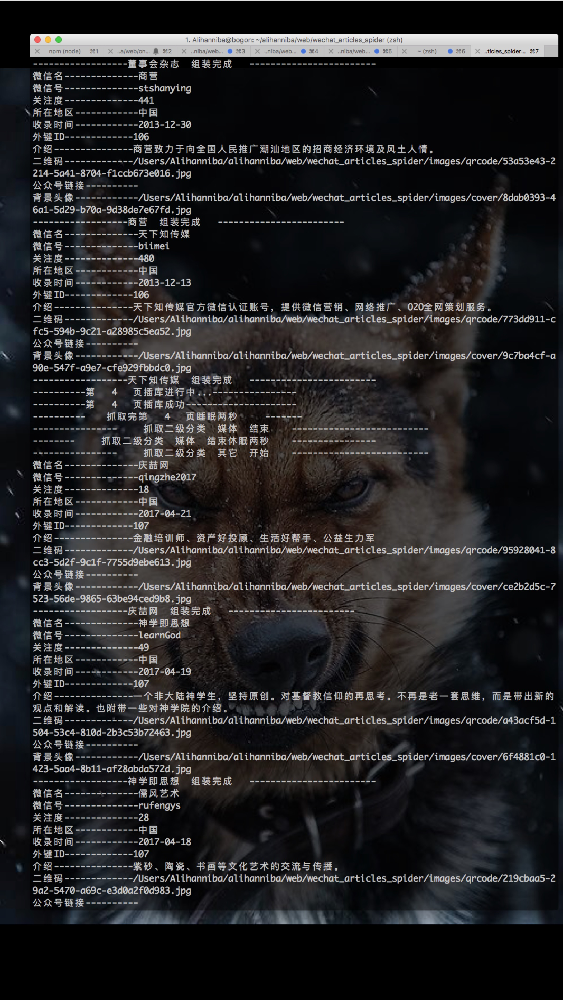
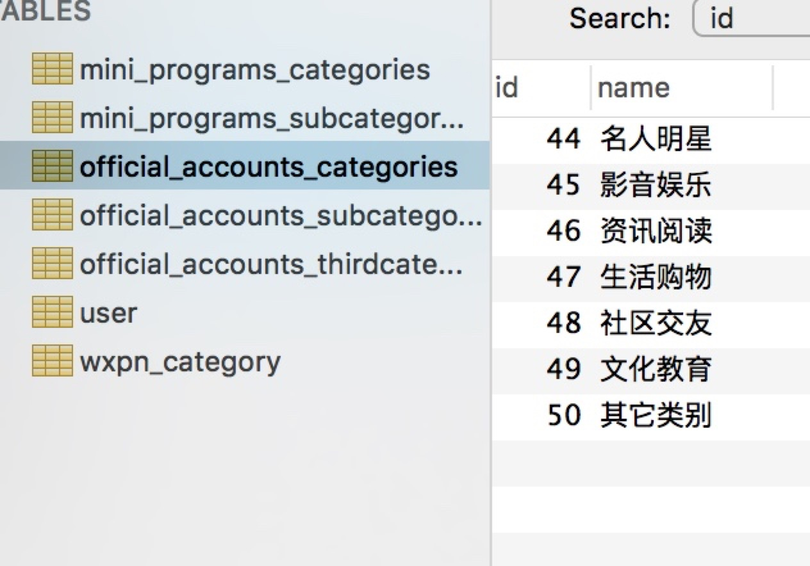
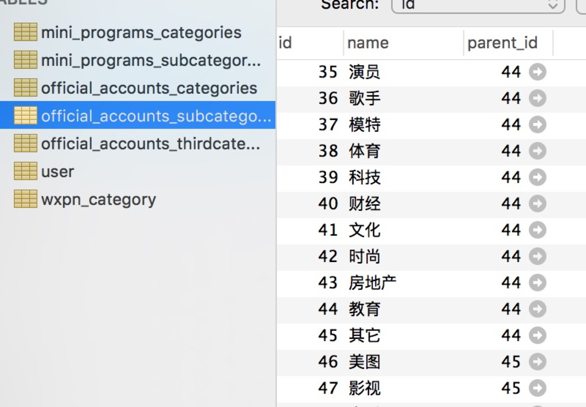
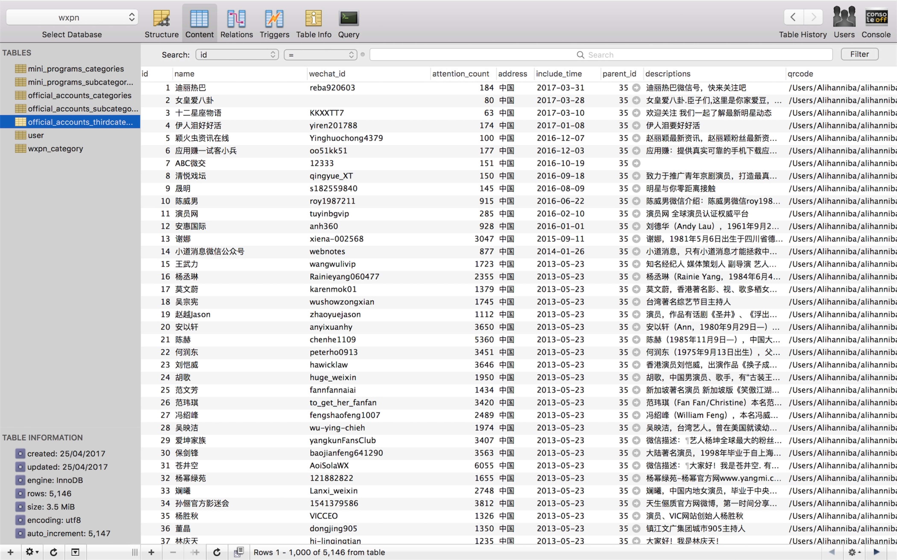

### 把爬取聚合网站整站的代码push上github是不道德的做法吗？

>题图：streetwill.co

业余时间在写一个聚合类App的后台api，苦于没有数据，只能在网上借点儿。

上周末花了一天时间在家里，做做饭、浇浇花、顺便借了点数据，上google搜了下这个主题，简单预览了下搜索结果排名第一的网站，就决定是它了。

* 技术栈
	* Python-3.5.0
	* Mysql-5.7.17
	* BeautifulSoup

* 主要数据
	* 公众号名
	* 公众号id
	* 关注度
	* 所在地区
	* 收录时间
	* 公众号介绍
	* 二维码
	* 背景头像
	* 公众号链接

爬取过程没啥难度，跟爬取微信官方链接耗时不一样，就是测试稍微费时间，偶尔跑到一半会卡死或者线程崩掉，最后把每爬取一页数据后的休眠时间调整了下。整站数据爬取入库需要大概一个小时，图片全部存储在本地，数据库存储的链接为本地路径加uuid生成的32位随机字符串。一级目录、二级目录、三级目录以外键关联，方便后续api开发。

以下是一些预览图：

代码地址如下，或点击阅读原文进入

[微信公众号分类收集爬虫](https://github.com/alihanniba/wechat_articles_spider)