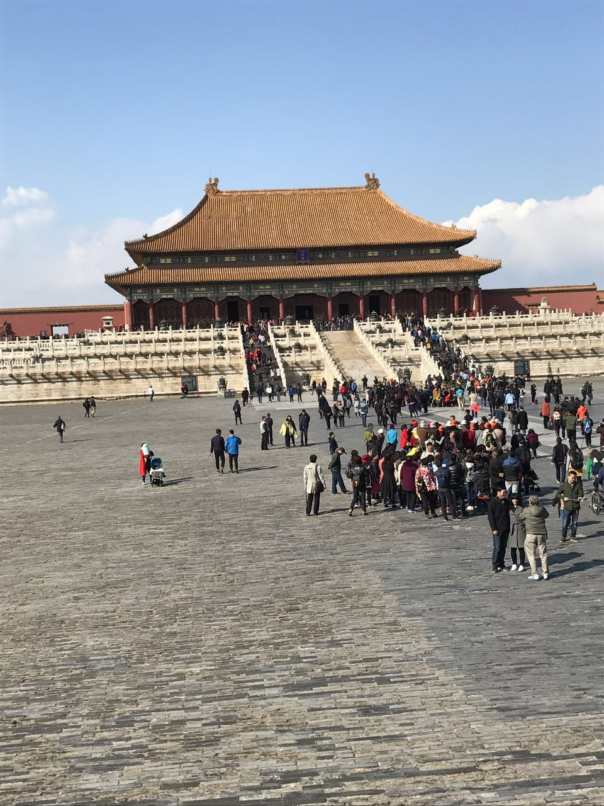
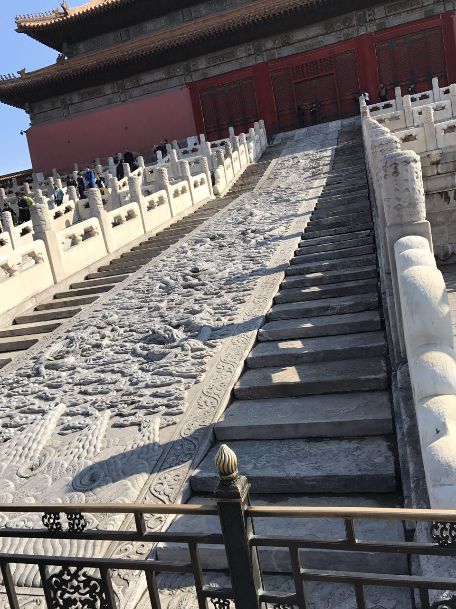
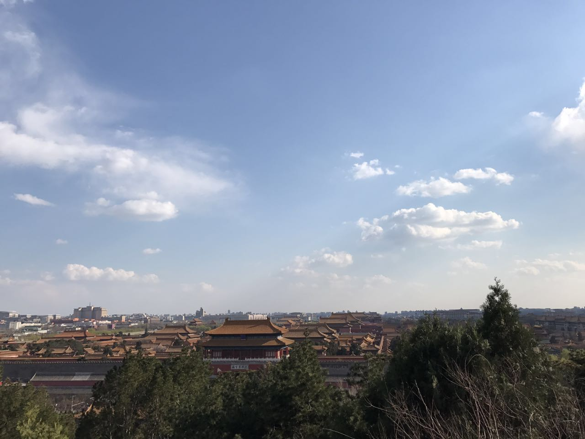
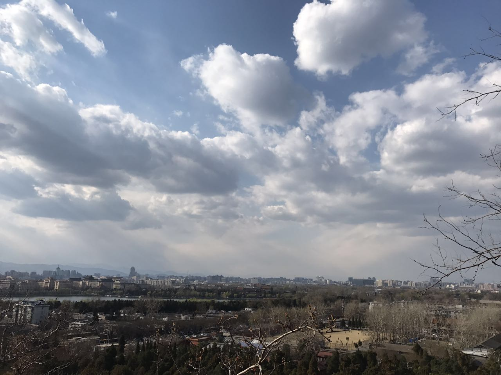
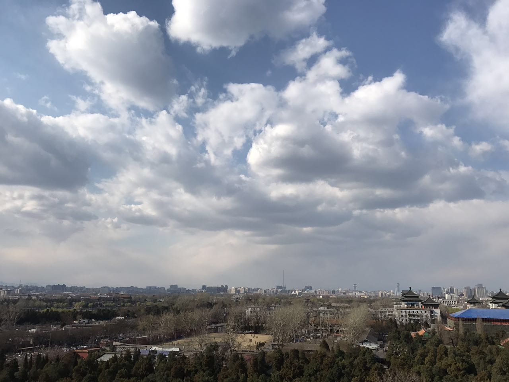
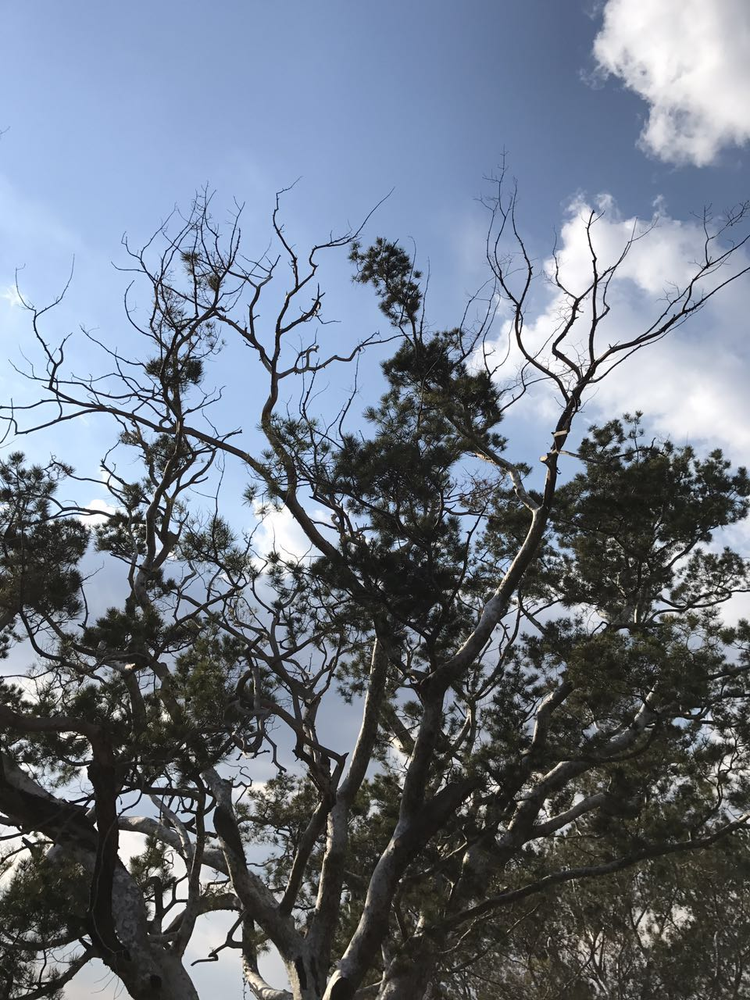
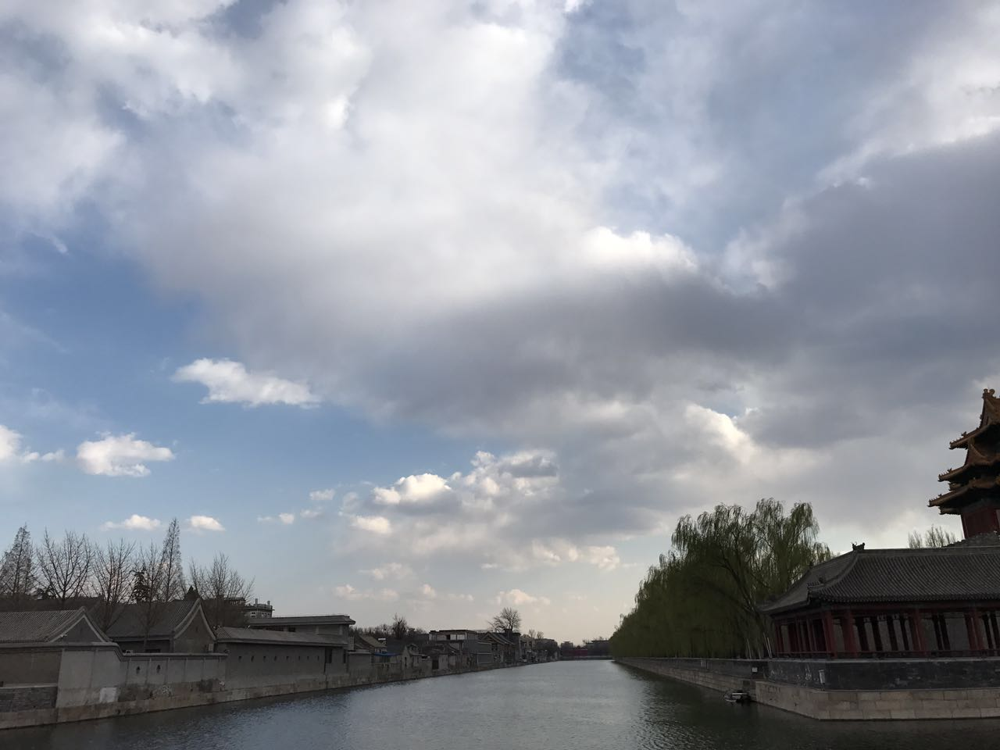
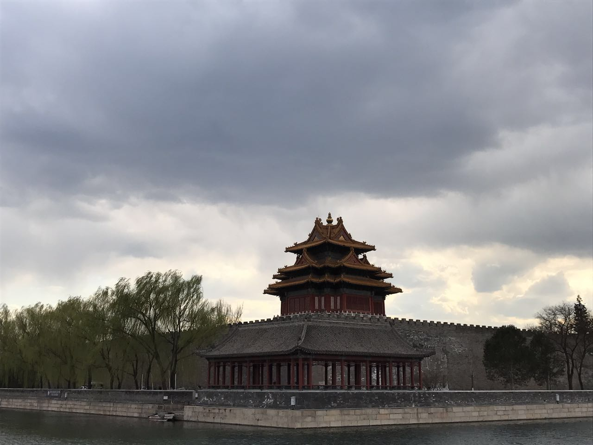

在酒仙桥待了一个月，公司又搬新办公室了。这已经是在北京的第四个上班地点了。

工作两年来，已经换了七个工作地点了。从广州天河都市华庭，到深圳南山天明科技大厦，再到深圳福田车公庙英龙大厦，跟着公司搬了三个地点。接着来北京在雍和宫上了两天班，跟着公司搬到百子湾。今年过来在将台上班刚好四十天，明天搬去四惠传媒大学附近。这经历也是没谁了。无事于心，概不拉扯。

上周末两天出去浪了，没有coding，一句都没有。周六去参加了极客邦和UCloud联合举办的一个活动---中国技术开放日（ChinaTech Day），这一次的主题是《电商后端技术大揭秘》，正好跟公司业务能沾上点边，去听了，挺赞。首先，干货是有的，京东架构部总架构师者文明《电商物流系统高可用架构实践》、当当网系统架构师高洪涛《如何从0到1搭建弹性作业云Elastic-Job-Cloud》、小红书技术部数据团队负责人叶晓敏《使用混合云搭建社区电商的数据分析平台》以及阿里巴巴天猫首席供应链业务架构师林杉《智能的供应链--阿里只会供应链中台2.0》，这四个演讲，个人觉得挺赞。因为其他三个我没听懂...额...其中最后一个演讲阿里架构师讲供应链的时候，群里讨论还是蛮激烈，虽说没怎么听懂，但都觉得此人是目前遇到最懂业务且能把业务讲的如此通透的架构师，听了一天的讲座，最后蹭了一顿饭，吃了点下午茶，拷了几个文档，幸滋滋的回去了。不过讲真，极客邦的午餐还是可以的。

周日闲来无事，骑着小黄车绕着住址遛了一圈。实在不想写代码，想着来北京大半年还没去过故宫博物馆，于是真的一个人直接冲到天安门，跨过护城河，浪里个浪，围着故宫走马观花瞧了一遍。半个小时后，稀里糊涂的跟着大队伍出来了，想再进去榨干下门票的价值，警察叔叔不让了。正好出来到了景山公园大门口，于是乎，花了两块钱买了张门票爬到山顶上，拍了一张故宫全景图，收工，回家。

每个月总有那么一两天感觉无所事事，不想看书，不想写东西，这是病，得治。当鸡血不够的时候，那么该是时候去看看那些打了鸡血的同胞们的生活与工作状态了，就会发现，曾经多少打酱油的骚年，也开始打着“国足都赢了，你还有什么理由不努力呢”这样的口号坑蒙拐骗了，这是病，得治。

话说，周日是第四届知乎盐Club，据说大V还是挺多的，怎么就错过了呢。

嗯，这是我第一次来这里，开始了，再见吧。

